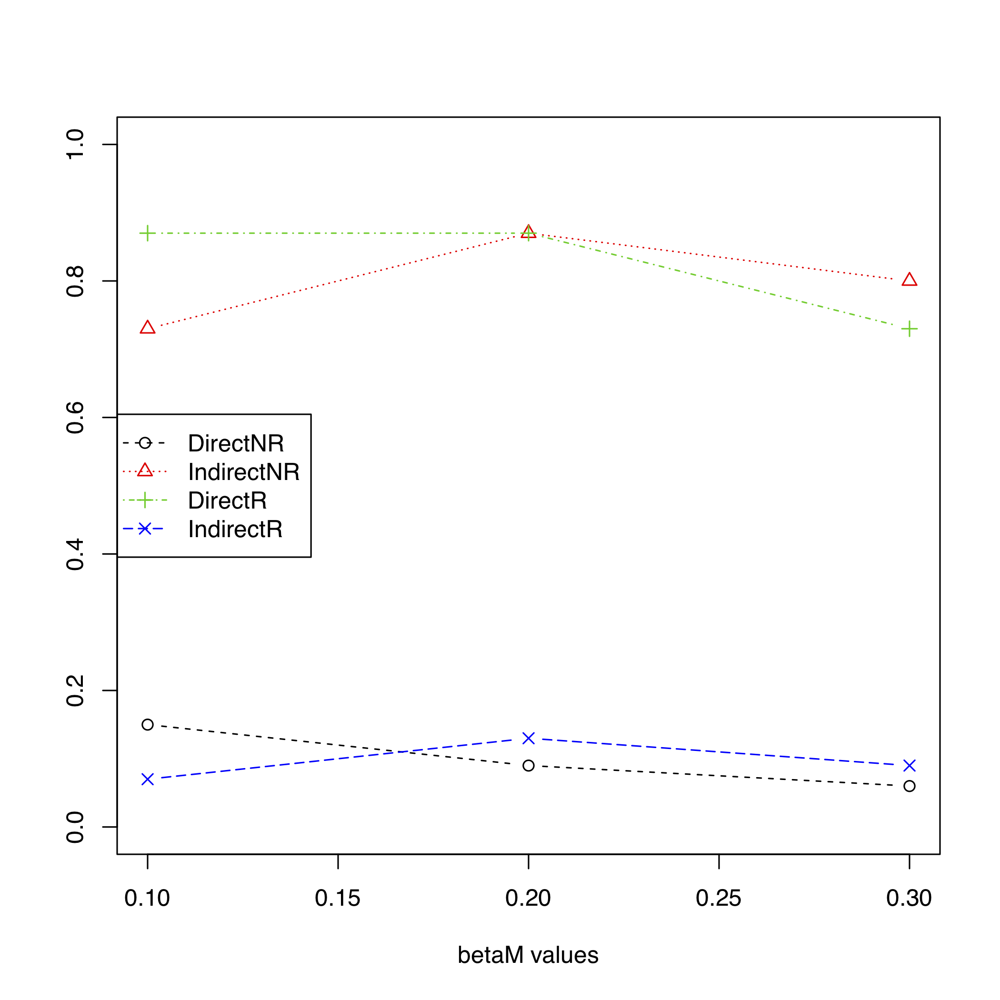

## reverseMA
Examines the indirect and direct path in mediation analysis when the mediator and outcome are either correctly or incorrectly specified

## Installation
```
# you need R v3.4 or higher
# devtools must be installed first
install.packages("devtools") 

devtools::install_github("SharonLutz/reverseMA")
```

## Example 1:
```
library(reverseMA)

# Direct effect of the exposure X on the outcome Y, but no indirect effect of the exposure X on the outcome Y through the mediator M
reverseMA(n = 1000, pX = 0.2, gamma0 = 0, gammaX = 0.2, varM = 1, beta0 = 0, betaX = 0, 
betaM = c(0.1, 0.2, 0.3), varY = 1, nSim = 100, nSimImai = 100, SEED = 1, plot.pdf = T, 
plot.name = "reverseMAplotIndirect.pdf", alpha_level = 0.05)
```

## Output 1
Direct effect of the exposure X on the outcome Y, but no indirect effect of the exposure X on the outcome Y through the mediator M




## Example 2:
```
library(reverseMA)

# Indirect effect of the exposure X on the outcome Y through the mediator M, but no direct effect of the exposure X on the outcome Y
 reverseMA(n = 1000, pX = 0.2, gamma0 = 0, gammaX = 0, varM = 1, beta0 = 0, betaX = 0.2, 
betaM = c(0.1, 0.2, 0.3), varY = 1, nSim = 100, nSimImai = 100, SEED = 1, plot.pdf = T, 
plot.name = "reverseMAplotDirect.pdf", alpha_level = 0.05)

#Both a direct and indirect effect of the exposure X on the outcome Y for a mediator M
 reverseMA(n = 1000, pX = 0.2, gamma0 = 0, gammaX = 0.2, varM = 1, beta0 = 0, betaX = 0.2, 
betaM = c(0.1, 0.2, 0.3), varY = 1, nSim = 100, nSimImai = 100, SEED = 1, plot.pdf = T, 
plot.name = "reverseMAplotBoth.pdf", alpha_level = 0.05)
```

## Output 2


## Example 3:
```
library(reverseMA)

#Both a direct and indirect effect of the exposure X on the outcome Y for a mediator M
 reverseMA(n = 1000, pX = 0.2, gamma0 = 0, gammaX = 0.2, varM = 1, beta0 = 0, betaX = 0.2, 
betaM = c(0.1, 0.2, 0.3), varY = 1, nSim = 100, nSimImai = 100, SEED = 1, plot.pdf = T, 
plot.name = "reverseMAplotBoth.pdf", alpha_level = 0.05)
```

## Output 3

