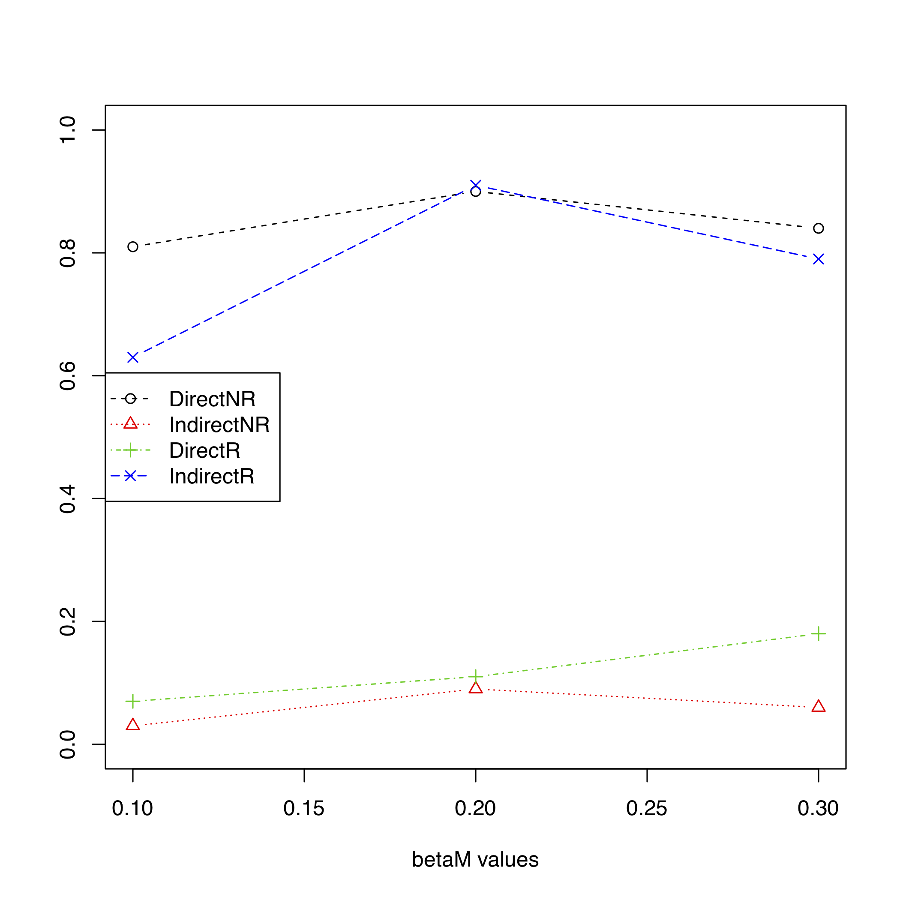

## reverseMA
Examines the indirect and direct path in mediation analysis when the mediator and outcome are either correctly or incorrectly specified.

## Installation
```
install.packages("mediation")# mediation package must be installed first 
install.packages("devtools") # devtools must be installed first

devtools::install_github("SharonLutz/reverseMA")
```

## Input
For n subjects (input n) for a given minor allele frequency (input pX), the SNP X is generated from a binomial distribution.

Then, the mediator M is generated from a normal distribution with the variance (input varM) and the mean as follows:

E\[M\] = &gamma;<sub>o</sub> + &gamma;<sub>X</sub>  X

where gamma0 and gammaX are inputted by the user.

Next, the outcome Y is generated from a normal distribution with the variance (input varY) and the mean as follows:

E\[Y\] = &beta;<sub>o</sub> +  &beta;<sub>X</sub> X  + &beta;<sub>M</sub> M 

where beta0, betaX, and betaM are inputted by the user. beta0 and betaX are only allowed to be a single value (i.e. beta0=0), but betaM should be inputted as a vector (i.e. betaM = c(0.1, 0.2, 0.3)).

## Output
After the SNP X, mediator M, and outcome Y are generated, then the reverseMA function runs mediation analysis twice: (1) the mediator and outcome are correctly specified, (2) the mediator and outcome are switched. A plot is then produced where the x axis is the values of betaM (i.e. the relationship between the mediator and outcome) and the y-axis is the proportion of simulations where there was a significant direct or indirect effect.

## Example 1:
For example 1, we generate a direct effect of the exposure X on the outcome Y (betaX=0.2), but no indirect effect of the exposure X on the outcome Y through the mediator M (gammaX=0). For this example, there are 1000 subjects (n=1000), a MAF of 0.2 (pX=0.2), M is generated from a normal distribution with a variance of 1 (varM=1), Y is generated from a normal distribution with a variance of 1 (varY=1), and the strength of the association between M and Y vairaes from 0.1 to 0.3 (betaM = c(0.1, 0.2, 0.3)). The code below runs this example.
```
library(reverseMA)

# Direct effect of the exposure X on the outcome Y
# But no indirect effect of the exposure X on the outcome Y through the mediator M

 reverseMA(n = 1000, pX = 0.2, gamma0 = 0, gammaX = 0, varM = 1, beta0 = 0, betaX = 0.2, 
betaM = c(0.1, 0.2, 0.3), varY = 1, nSim = 100, nSimImai = 100, SEED = 1, plot.pdf = T, 
plot.name = "reverseMAplotDirect.pdf", alpha_level = 0.05)
```

## Output 1
 As seen in the plot below, there is a significant direct effect if the mediator and outcome are correctly specified (directNR), but counter to how the data was generated, there is a significant indirect effect if the mediator and outcome are incorrectly specified (indirectR).



## Example 2:
Example 2 is similar to Example 1 except we now generate an indirect effect of the exposure X on the outcome Y (gammaX=0.2), but no direct effect of the exposure X on the outcome Y through the mediator M (betaX=0). The code below runs this example.
```
library(reverseMA)

# Indirect effect of the exposure X on the outcome Y through the mediator M
# But no direct effect of the exposure X on the outcome Y

reverseMA(n = 1000, pX = 0.2, gamma0 = 0, gammaX = 0.2, varM = 1, beta0 = 0, betaX = 0, 
betaM = c(0.1, 0.2, 0.3), varY = 1, nSim = 100, nSimImai = 100, SEED = 1, plot.pdf = T, 
plot.name = "reverseMAplotIndirect.pdf", alpha_level = 0.05)
```

## Output 2
As seen in the plot below, there is a significant indirect effect if the mediator and outcome are correctly specified (indirectNR), but counter to how the data was generated, there is a significant direct effect if the mediator and outcome are incorrectly specified (directR).


## Example 3:
Example 3 is similar to Example 1 except we generate both a direct (betaX=0.2) and indirect effect (gammaX=0.2) of the exposure X on the outcome Y for a mediator M.
```
library(reverseMA)

#Both a direct and indirect effect of the exposure X on the outcome Y for a mediator M
 reverseMA(n = 1000, pX = 0.2, gamma0 = 0, gammaX = 0.2, varM = 1, beta0 = 0, betaX = 0.2, 
betaM = c(0.1, 0.2, 0.3), varY = 1, nSim = 100, nSimImai = 100, SEED = 1, plot.pdf = T, 
plot.name = "reverseMAplotBoth.pdf", alpha_level = 0.05)
```

## Output 3
As seen in the plot below, there is both a significant direct and indirect effect of the exposure X on the outcome Y for a mediator M.


## Speed Improvements using C++ Bindings and Threading
A version of this package called reverseMAthread implements support for threading and a version of the mediation algorithm implemented using RcppEigen which can provide a significant boost in speed akin to multiprocessing but with less of a memory footprint.

Find it here [ReverseMAthread](https://github.com/SharonLutz/reverseMAthread)
